# Almacenamiento en caché con Node.js y Redis
## ¿Qué es el caché y cómo puede ayudarnos?

La caché es el proceso con el que los datos se almacenan temporalmente en un área de componentes de almacenamiento para poder ser utilizados en el futuro con mayor rapidez. Por ej.. Si tenemos algunos datos que provienen de una API de terceros

## ¿Qué es Redis?

Redis es una base de datos NoSQL de código abierto y tiene un alto rendimiento que se utiliza principalmente como solución de almacenamiento en caché para varios tipos de aplicaciones. Almacena todos sus datos en RAM y promete lecturas y escrituras de datos altamente optimizadas.

## Ejemplo
- Instalar redis, en mi caso lo levanto desde Docker. Ver figura 1.

   **Comando:** run -p 6379-6379 -name some-redis -d redis
   
  
 
      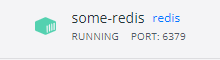
  

  
 
      Figura 1. Base de Datos en Redis.
  

  
   
- Instalar el módulo **redis** para poder conectarme a redis, después instalo **express** para poder crear un servidor básico, un módulo **response-time** para medir el tiempo de respuesta y por último instalo **nodemon**.

   **Comando:** npm i redis express response-time nodemon

- Realizamos una petición con el módulo axios. Ver figura 2.

   
 
      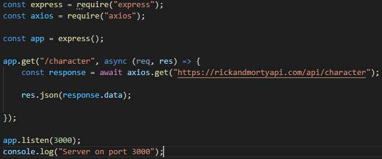
  

  
 
      Figura 2. Petición con axios.
  

   
  Y probamos en el navegador y vemos que abrió correctamente. Ver figura 3.
   
   
 
      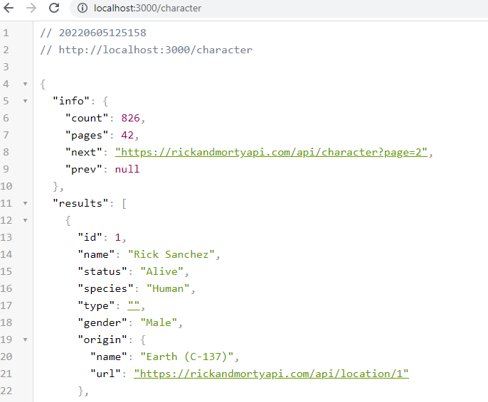
  

  
 
      Figura 3. Obtención de datos de la Api.
  

   
- En el navegador le damos a **inspeccionar** nos dirigimos a la parte de **red** o **netword** y presionamos, nos saldrá un 200 ok lo que indica que la solicitud ha tenido éxito en la url solicitada. Ver figura 4.

   
 
      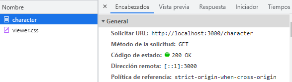
  

  
 
      Figura 4. Estado de solicitud correctamente.
  

   
- Ahora si queremos ver cuánto tiempo tarda al obtener esto, para medirlo utilizamos el módulo **response-time**. Ver figura 5.

   
 
      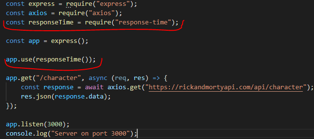
  

  
 
      Figura 5. Tiempo de respuesta.
  

   
  Y verificamos nuevamente en character en la parte de encabezado, y podemos observar el tiempo de respuesta **X-Response: 1148.496ms**, es el tiempo de respuesta de la Api que utilizamos. Ver figura 6.

   
 
      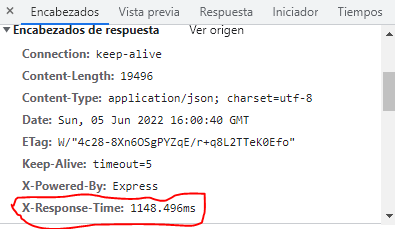
  

  
 
      Figura 6. Tiempo de respuesta en segundos.
  

   
- Para conectarme a redis utilizo el siguiente código, donde creo 2 objetos indicando el **host:"127.0.0.1"** donde está mi base de datos de redis localmente y el puerto **port: 6379** de redis. Redis solo guarda string, entonces para convertir un objeto a string utilizamos el método JSON.stringify. Ver figura 7.

   
 
      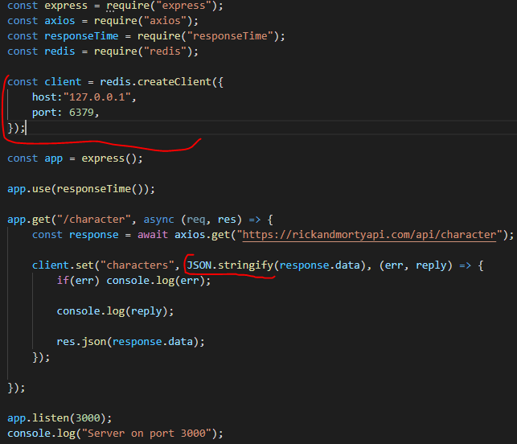
  

  
 
      Figura 7. Conexión a Redis y conversión de los objetos a string.
  

  Para ver lo que guarde en redis utilizamos **redis commander**, ejecutamos:

  **Comando para instalar:** npm install -g redis-commander 

  **Comando para correrlo:** redis-commander

  Para visualizarlo nos vamos a la url que nos da al ejecutar **redis-commander**. Ver figura 8.

   
 
      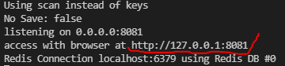
  

  
 
      Figura 8. Url de redis commander.
  

  Observamos dentro de la base de datos de redis una variable **characters** y vemos lo que contiene. Ver figura 9.

   
 
      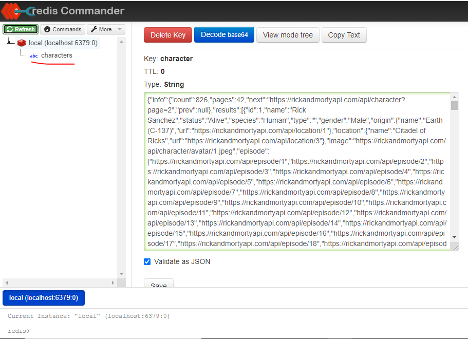
  

  
 
      Figura 9. Datos de la api dentro de la variable character.
  

- Para solo centrarnos cuanto tiempo tarda la rest Api y ejecutar el mismo, instalamos la extensión **REST Client** que nos permite realizar llamadas **HTTP** desde el propio editor Visual Studio Code de una forma muy sencilla. Ver figura 10.

   
 
      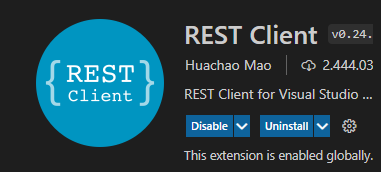
  

  
 
      Figura 10. Extención REST Client.
  

  Una vez instalado, nos permite crear un archivo para las llamadas, finalizando con un **.http**. Ver figura 11.

   
 
      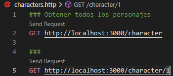
  

  
 
      Figura 11. Solicitudes de envio.
  

- Cambiamos completamente el código para que sea más prolijo y nos queda como esta subido en este **GitHub**.

  Realizamos 2 pruebas presionando **Sen Request**, la primera es para obtener todos los personajes y la segundo para obtener un personaje con el id, donde observamos que al lado nos sale una ventana **Response** con los segundos que tardo la api en responder. Ver figura 12 y 13.
  
   
 
      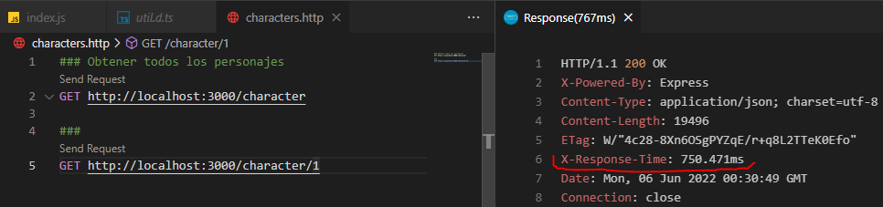
  

  
 
      Figura 12. Obtención de todos los personajes de la api.
  

     
  
 
      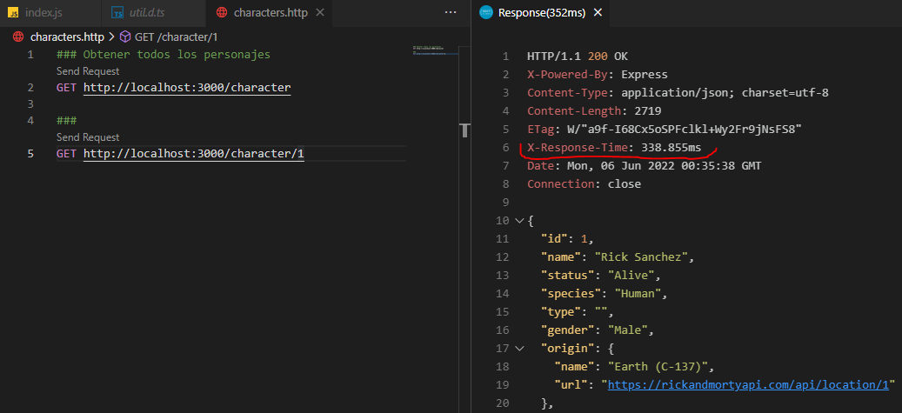
  

  
 
      Figura 13. Obtención del personaje de id 1 de la api.
  

     
   Ahora vemos como se guarda en redis, y nos muestra las peticiones que realizamos, una para obtener todos los personajes y otro para obtener solo un personaje. Ver figura 14.
     
  
 
      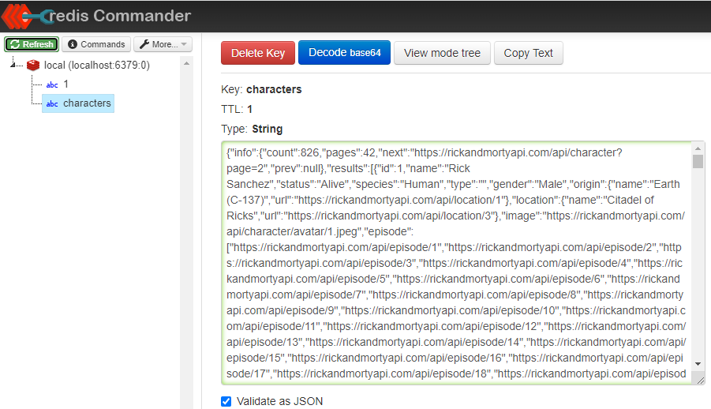
  

  
 
      Figura 14. Peticiones guardadas en redis.
  

     
     
  
  

